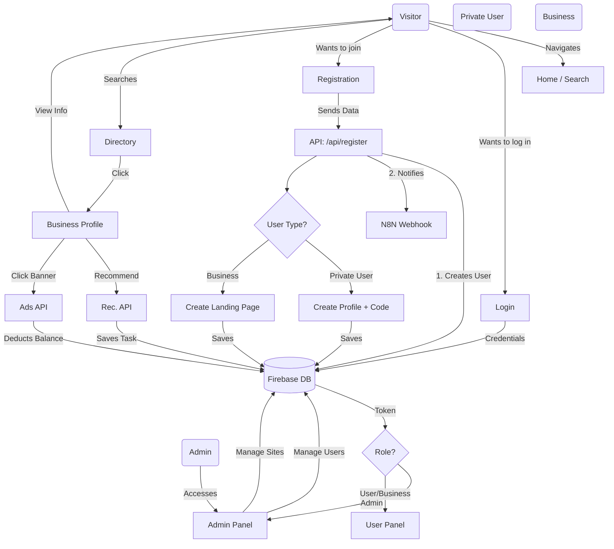

# Arquitectura del Sistema Dicilo - Diagrama de Flujo

Este documento describe el flujo operativo y la arquitectura del sistema Dicilo, detallando las interacciones entre los diferentes tipos de usuarios y los procesos principales del sistema.

## Diagrama de Flujo del Sistema (Flowchart)

## Explicación Detallada de los Módulos

### 1. Sistema de Usuarios y Roles
El sistema diferencia claramente entre cuatro tipos de actores:
*   **Visitante**: Usuario no autenticado que busca y navega.
*   **Privat User (Usuario Privado)**: Individuo registrado que obtiene un **Código Único** (e.g., DHH25NE...) para participar en el sistema de recompensas. Tiene un perfil privado.
*   **Business (Empresa)**: Puede ser *Starter*, *Retailer* (Minorista) o *Premium*. Tienen acceso a un panel para gestionar su información y una **Landing Page** pública generada automáticamente.
*   **Administrador**: Gestiona todo el contenido, usuarios, validaciones y configuración global.

### 2. Flujo de Registro (/api/register)
Es el "corazón" de la entrada de datos. Al registrarse:
1.  Se crea el usuario en **Firebase Authentication**.
2.  Se guarda el registro en la colección `registrations`.
3.  **Automatización**:
    *   Si es **Privat User**: Se genera y guarda automáticamente su ficha en `private_profiles` con su código único.
    *   Si es **Empresa**: Se genera automáticamente su documento en `clients` (Landing Page) para que sea visible de inmediato.
4.  Se envía un webhook a **N8N** para integraciones externas (CRM/ERP).

### 3. Sistema de Directorio y Búsqueda
Los visitantes buscan empresas por categoría, ubicación o texto libre. El sistema consulta Firestore y muestra resultados priorizados (Premium/Retailer primero).
Al hacer clic, se accede a la **Landing Page del Cliente**, que es una página dinámica (`/client/[slug]`) construida con componentes modulares (Galería, Mapa, Video, Reseñas).

### 4. Sistema de Recomendaciones
Integrado en las landing pages. Permite a un usuario recomendar una empresa a amigos.
*   Se crea un registro de recomendación.
*   El sistema genera "Tareas de Recomendación" (`recommendation_tasks`) que disparan correos electrónicos con enlaces de aceptación/rechazo.

### 5. Wallet y Ads Manager
*   Las empresas tienen un "Monedero" (`budget_remaining`).
*   Los administradores pueden crear **Banners Publicitarios**.
*   Cuando un usuario hace clic en un anuncio, la API (`/api/ads/click`) descuenta automáticamente el costo del clic del saldo de la empresa y registra el evento para estadísticas.

### 6. Panel de Administración
Centraliza la gestión. Permite:
*   Ver y exportar usuarios privados (CSV).
*   Editar el diseño y contenido de las empresas (`LayoutEditor`).
*   Aprobar recargas de saldo (Top-ups).
*   Gestionar traducciones y categorías.
